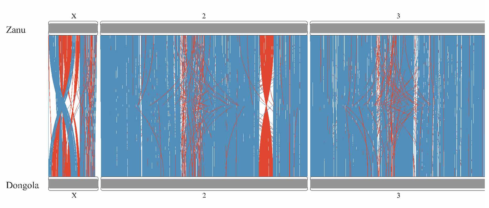

```{r setup, include=FALSE}
knitr::opts_chunk$set(echo = TRUE)
```


```{r }
library("RIdeogram")
library("dplyr")
```


# Read all data


```{r}
gene_mapping <- read.csv('gene_mapping.tsv', sep='\t')
dongola <- read.csv("DONGOLA_genes.tsv", sep='\t')
zanu <- read.csv("ZANU_genes.tsv", sep='\t')

head(gene_mapping)
```

# Filter mapping data

## Choose only 2, 3, X chr

```{r}
gene_mapping <- gene_mapping[gene_mapping$contig %in% c('2', '3', 'X'),]
unique(gene_mapping$contig)
```

## Split DONG column and drop it

```{r}
gene_mapping <- cbind(gene_mapping, setNames(data.frame(x = do.call('rbind', strsplit(as.character(gene_mapping$DONG), ',', fixed=TRUE))), c('seq_id_d', 'middle_d', 'strand_d', 'length_d', 'name_d')))[,!(names(gene_mapping) %in% c('DONG'))]
head(gene_mapping)
```

## Transform name of DONGOLA genes in gene mapping table to format that used in DONGOLA csv.

```{r}
head(gene_mapping)
```


```{r}
head(dongola)
```


We need to remove "DONG" at the beginning of the name.

```{r}
gene_mapping$name_d <- gsub("^DONG_(\\w+)", "\\1", gene_mapping$name_d)
```

## Calculate distance between genes

```{r}
gene_mapping$middle_d <- as.numeric(gene_mapping$middle_d)
gene_mapping$distance <- abs(gene_mapping$middle.position - gene_mapping$middle_d)
```

# Mapping 1:1 ZANU to DONGOLA genes


## Function to choose closest not reserved dongola gene for mapping

```{r}
choose_closest_not_used_gene <- function(final_mapping) {
  
  #first we will map the genes with less distance.
  #For this we will sort all possible maps by distance in ascending order
  #p.s. That is not best options, because it can be more suitable variations
  #of closest genes
  gene_mapping <<- gene_mapping[order(gene_mapping$distance),]
  
  #here will be present the name of Dongola genes that were already mapped with
  #some ZANU gene.
  #It is need, because we have duplicated DONGOLA genes that shared between
  #multiple ZANU genes
  dongola_name_buffer <- c()

  for (zname in unique(gene_mapping$name)){
    #choose rows with this name
    tmp_rows = gene_mapping[gene_mapping$name == zname,]
    
    #sort by distance to iterate from min to max
    tmp_rows <- tmp_rows[order(tmp_rows$distance),]
    for (i in 1:nrow(tmp_rows)) {
      dname <- tmp_rows[i, ]$name_d 
      contig <- tmp_rows[i, ]$contig 
      
      if (!(dname %in% dongola_name_buffer)) {
        #add to buffer
        append(dongola_name_buffer, dname)
        
        #add to final mapping table
        final_mapping <- rbind(final_mapping, data.frame(chr=contig, zname=zname,
                                                         dname=dname))
        break
      }
    }
  }
  
  return(final_mapping)
}
```

## make table with the most closest genes

```{r}
final_mapping <- setNames(data.frame(matrix(ncol = 3, nrow = 0)), c("chr", "zname", "dname"))

final_mapping <- choose_closest_not_used_gene(final_mapping)
head(final_mapping)
```


# Make tables for plots

```{r}
create_karyotype_table <- function(final_mapping, specie1, specie2) {
  
  synteny_table_dual <- setNames(data.frame(matrix(ncol = 7, nrow = 0)),
                                   c("Species_1", "Start_1", "End_1", "Species_2", 
                                     "Start_2", "End_2", "fill"))
  
  final_mapping <- final_mapping[order(final_mapping$chr),]
  
  j = 1
  
  for(i in 1:nrow(final_mapping)) {
    tmp_row <- final_mapping[i, ]
    
    
    zname = tmp_row$zname[1]
    dname = tmp_row$dname[1]
    chr = tmp_row$chr[1]
    
    specie1_row <- specie1[specie1$ID == zname,]
    specie2_row <- specie2[specie2$ID == dname,]
    
    specie_num <- switch(chr, "X" = 1, "2" = 2, "3" = 3)
    
    #5891bf - blue
    #db4527 - red
    color_to_fill <- if (specie1_row$strand[1] == specie2_row$strand[1]) '5891bf' else 'db4527'
    
    synteny_table_dual <- rbind(synteny_table_dual, 
                                data.frame(Species_1=specie_num, Start_1=specie1_row$start,
                                           End_1=specie1_row$end,
               Species_2=specie_num, Start_2=specie2_row$start, End_2=specie2_row$end,
               fill=color_to_fill))
    
  
    j <- j + 2
  }
  
  return (synteny_table_dual)
}
```

## Function for map initial specie table with info about chr

```{r}
add_chr_info <- function(s1, gene_mapping) {
  s1 <- cbind(s1, setNames(data.frame(matrix(ncol = 1, nrow = nrow(s1))),
                                   c("Chr")))
  
  for (name in unique(gene_mapping$name_d)) {
    
    chr <- gene_mapping[gene_mapping$name_d == name,]$contig[1]
    
    s1$Chr[s1$ID == name] <- chr[1]
  }
  
  return (s1)
}
```


## calculate approx. length of DONGOLA chr

```{r}
#calculate approx. length of DONGOLA chr
dongola <- add_chr_info(dongola, gene_mapping)
maxX <- max(dongola[dongola$Chr == 'X',]$end[!is.na(dongola[dongola$Chr == 'X',]$end)])
max2 <- max(dongola[dongola$Chr == '2',]$end[!is.na(dongola[dongola$Chr == '2',]$end)])
max3 <- max(dongola[dongola$Chr == '3',]$end[!is.na(dongola[dongola$Chr == '3',]$end)])
```

## Final

```{r}
synteny_table_dual <- create_karyotype_table(final_mapping, zanu, dongola)

#karyotype table contains info about chromosomes
karyotype_table_dual <- setNames(data.frame(matrix(ncol = 7, nrow = 0)),
                                   c("Chr", "Start", "End", "fill", 
                                     "species", "size", "color"))
#the length of ZENU chr was taken from HW3 description
karyotype_table_dual <- rbind(karyotype_table_dual,
                              data.frame(Chr=c('X','2','3'), Start=c(1, 1, 1),
                                             End=c(27238055, 114783175, 97973315),
                                         fill='969696',
                                             species='Zanu', size=12, color='252525'))
karyotype_table_dual <- rbind(karyotype_table_dual,
                              data.frame(Chr=c('X','2','3'), Start=c(1, 1, 1),
                                             End=c(maxX, max2, max3),
                                         fill='969696',
                                             species='Dongola', size=12, color='252525'))

```


# Plot with Rideogram

```{r}
ideogram(karyotype = karyotype_table_dual, synteny = synteny_table_dual)
convertSVG("chromosome.svg", device = "png")
```



